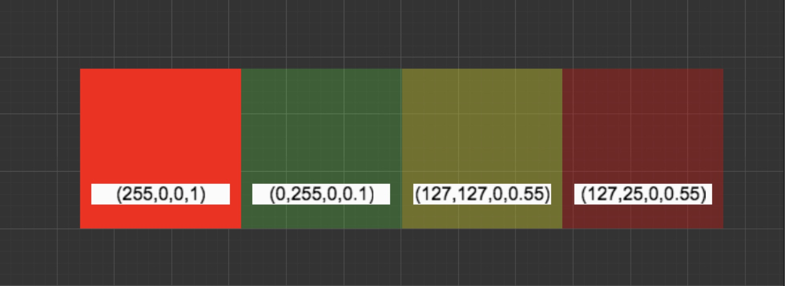

Tham khảo: https://docs.cocos.com/creator/2.1/manual/en/asset-workflow/sprite.html#premultiply-alpha

Premutiply Alpha ( Nhân trước chỉ số alpha)

Kênh Alpha sẽ được nhân trước với kênh RGB khi RGB được lưu.

Ví dụ: 

Ta có : RGB hiện tại là (255,0,0), giá trị màu khi lưu sau 
        khi premultiply là (127, 0, 0, 0.5)

Non-Premultiply Alpha: 
Kênh Alpha sẽ không được nhân với kênh RGB. 
Khi đó, màu đỏ với độ trong suốt 50% như đã mô tả ở 
trên sẽ được lưu dưới dạng (255, 0, 0, 0.5).    

Tại sao lại sử dụng Premultiply Alpha?

Trong việc kết xuất texture, texture trong suốt sử dụng 
Alpha Blending để pha trộn, và công thức pha trộn là:

result = source.RGB * source.A + dest.RGB * (1 - source.A);

Khi sử dụng Premultiply Alpha, phép tính trên được đơn giản hóa thành:

result = source.RGB + dest.RGB * (1 - source.A);

Nhưng việc sử dụng Premultiply Alpha không chỉ để đơn giản hóa phép tính nhằm cải thiện hiệu suất, mà còn bởi vì texture sử dụng Non-Premultiply Alpha không thực hiện đúng việc nội suy tuyến tính (linear interpolation).

Giả sử có hai màu pixel liền kề, một là đỏ với độ trong suốt 100% (255, 0, 0, 1.0), và một là xanh lá với độ trong suốt 10% (0, 255, 0, 0.1). Khi texture bị co dãn, màu giữa hai điểm ảnh đó là kết quả của nội suy tuyến tính. Nếu sử dụng Non-Premultiply Alpha, kết quả là:

(255, 0, 0, 1.0) * 0.5 + (0, 255, 0, 0.1) * (1 - 0.5) = (127, 127, 0, 0.55)

Nếu sử dụng Premultiply Alpha, giá trị được lưu của màu xanh lá là (0, 25, 0, 0.1), và kết quả nội suy tuyến tính với màu đỏ là:

(255, 0, 0, 1.0) * 0.5 + (0, 25, 0, 0.1) * (1 - 0.5) = (127, 12, 0, 0.55)

Các giá trị màu tương ứng được biểu diễn như sau:

Có thể thấy từ hình minh họa phía trên rằng màu sau khi nội suy bằng Non-Premultiply Alpha sẽ hơi xanh, vì màu xanh lá với độ trong suốt 10% có tỉ trọng lớn hơn, còn màu đỏ với độ trong suốt 100% lại ít hơn. Trong khi đó, kết quả nội suy thu được khi dùng Premultiply Alpha là đúng và như mong đợi.