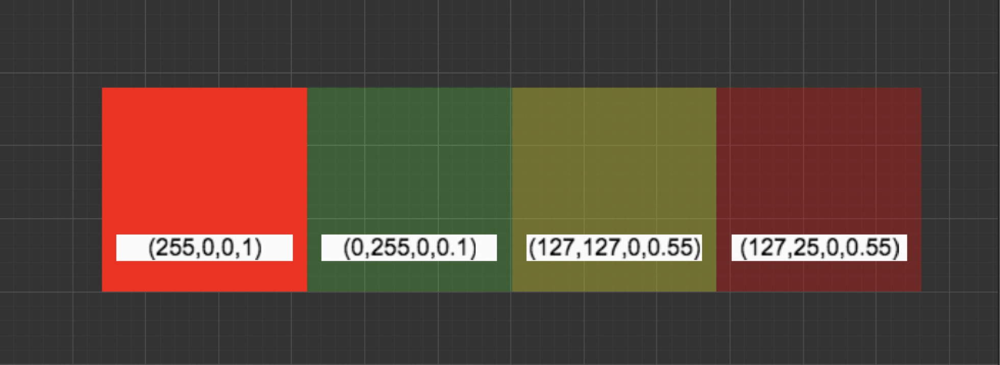

# Premultiply Alpha (Nhân trước chỉ số alpha)

## Tổng quan

Premultiply Alpha là kỹ thuật xử lý hình ảnh trong đó kênh Alpha được nhân trước với các kênh RGB khi lưu trữ dữ liệu màu sắc.

> Tham khảo: [Tài liệu Cocos Creator về Premultiply Alpha](https://docs.cocos.com/creator/2.1/manual/en/asset-workflow/sprite.html#premultiply-alpha)

## So sánh phương pháp

| Phương pháp | Mô tả | Ví dụ (Màu đỏ với độ trong suốt 50%) |
|-------------|-------|--------------------------------------|
| **Premultiply Alpha** | Kênh Alpha được nhân trước với kênh RGB | (127, 0, 0, 0.5) |
| **Non-Premultiply Alpha** | Kênh Alpha không được nhân với kênh RGB | (255, 0, 0, 0.5) |

## Lợi ích của Premultiply Alpha

### 1. Đơn giản hóa công thức pha trộn (Alpha Blending)

**Công thức thông thường:**
```
result = source.RGB * source.A + dest.RGB * (1 - source.A)
```

**Công thức với Premultiply Alpha:**
```
result = source.RGB + dest.RGB * (1 - source.A)
```

### 2. Nội suy tuyến tính (Linear Interpolation) chính xác hơn

Xét ví dụ hai pixel liền kề:
- Pixel 1: Màu đỏ, độ trong suốt 100% (255, 0, 0, 1.0)
- Pixel 2: Màu xanh lá, độ trong suốt 10% (0, 255, 0, 0.1)

#### Kết quả nội suy tuyến tính với Non-Premultiply Alpha:
```
(255, 0, 0, 1.0) * 0.5 + (0, 255, 0, 0.1) * (1 - 0.5) = (127, 127, 0, 0.55)
```

#### Kết quả nội suy tuyến tính với Premultiply Alpha:
Với Premultiply Alpha, giá trị màu xanh lá được lưu là: (0, 25, 0, 0.1)
```
(255, 0, 0, 1.0) * 0.5 + (0, 25, 0, 0.1) * (1 - 0.5) = (127, 12, 0, 0.55)
```

## Minh họa trực quan



### Nhận xét:
- **Non-Premultiply Alpha**: Màu sau khi nội suy có sắc xanh rõ hơn, vì màu xanh lá (dù chỉ có độ trong suốt 10%) lại có trọng số lớn hơn so với màu đỏ (độ trong suốt 100%).
- **Premultiply Alpha**: Kết quả nội suy chính xác và đúng như mong đợi về mặt trực quan.

## Kết luận

Premultiply Alpha không chỉ giúp cải thiện hiệu suất nhờ đơn giản hóa phép tính, mà còn đảm bảo kết quả nội suy màu sắc chính xác hơn, đặc biệt quan trọng khi làm việc với texture có độ trong suốt khác nhau.